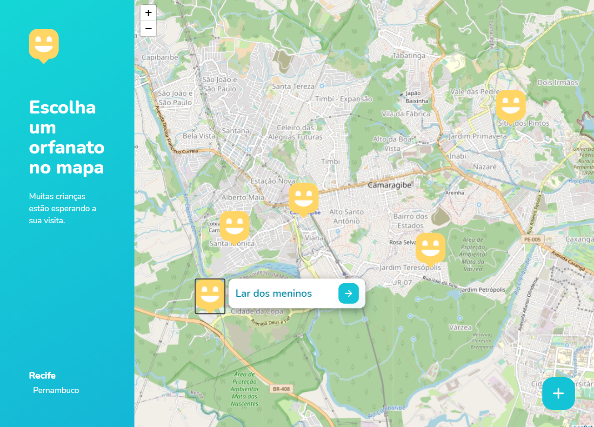

<h4 align="center">
  🚀 NextLevelWeek 3.0
</h4>

 Projeto auxíliado pela Rocketseat.


## Tecnologias

- Node.JS
- Hbs
- SqLite-async
- Express

<p align="center">
    
</p>

 Projeto para alocar orfanatos regionais, página de cadastro, mapa para localização dos orfanatos e página de exibição para cada orfanato cadastrado.

## Instalação de depedências


```bash
npm install
npm start
```

No navegador digite : `localhost:3000`
